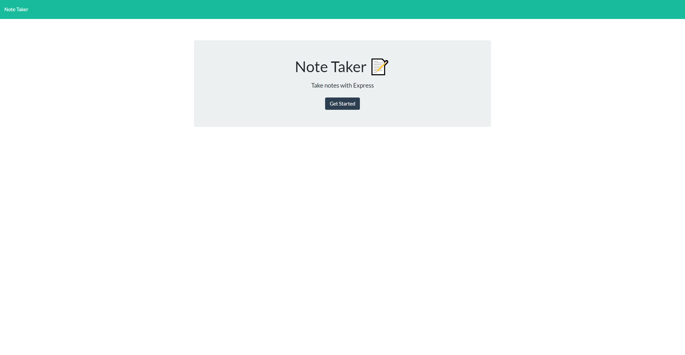

## Note Taker

    

a working server app that can take notes and save them allowing you to look back at them

## Table of contents

- [Description](#description)
- [Installation](#installation)
- [Usage](#usage)
- [Contributing](#contributing)
- [Tests](#tests)
- [license](#license)
- [Questions](#questions)

## Installation
express	path

## Usage
Taking notes 

## Contributing

Max Wittner
## Tests

undefined
## license 
    
    [Apache](https://opensource.org/licenses/Apache)

## Questions

Email: Maxwittner01@gmail.com
Github: https://www.github.com/lilslash

!(https://notetaker-app1.herokuapp.com/)
    
